# Modern-Ecommerce-Platforms
Design and Develop Modern Ecommerce Plafform

Nasrudin yusof
# Abstract
This project is about the development of Daria collection's e-commerce website. The platform leverages WordPress and WooCommerce, providing a smooth and secure buying experience for covers and clothing. This document provides an overview of the project, methods, software requirements. and an overview with images The Business Process Model and Notation (BPMN) is also displayed, which describes the process and functionality of the website. This project aims to create a user-centric online store. Bridging the gap between purchasing covers in-store and digitally.

# 1. Introduction
In a world where shopping has become digital, Daria collection is going online. This project is all about introducing the Daria collectione-commerce website, where we bring the charm and variety of our physical stores to the internet.

Our e-commerce website powered by WordPress and WooCommerce makes shopping for covers and clothing easy. This introduction will give you a quick look at what we aim to achieve. and how we connect the online world to the book buying world.

In the following section We'll dive into the project's methodology, technology, and strategy. The goal was to create an online cover store that was attractive and easy to use. Through this project, Daria collection reinforces its commitment to promoting the love of literature in the digital age.

# 2. Method
  At first, we had to download Laragon and Runaragon in order to log in to Wordpress. Once successfully logged in, it will open Wordpress for us. There won't be much there. Everything we want to do or need we have to download ourselves. Can be downloaded within Wordpress The first thing we need to do is our website page. In making website pages, we have 2 routes to choose from. First, design it yourself. Second, find someone else's theme and turn it into your website page. I chose to find someone else's theme to use. I chose the Shope theme version 1.0.1 by SwiftStore on their website page. His theme is selling clothes. and choose a theme to change to make a website selling veils We have chosen a theme and the next step is to decorate our website. What do you want it to be like? Whatever you want, we can do as we want. We finished decorating everything. We have to put in the products we want and set the right price. Next we will add the plugin. First we need to explain what a plugin is. Plugins are WordPress extensions in the form of scripts that improve performance. and expand the ability to make a simple website into a complete website More suitable for use for each purpose

# 3. Software and Tools Used
3.1 Laragon: Laragon is utilized as our local development environment, providing a convenient platform for building and testing the Daria collection shop E-Commerce Website before deployment.

3.2 WordPress: WordPress serves as the primary content management system (CMS) for our website, offering a flexible and user-friendly environment for managing web content.

3.3 WooCommerce: WooCommerce is integrated seamlessly with WordPress, empowering our website with e-commerce capabilities, including product management, shopping cart functionality, and secure payment processing.

3.4 Elementor: Elementor Elementor is a versatile page builder plugin employed to streamline the design process. It allows for easy customization of layouts and visual elements, enhancing the website's aesthetics and functionality.

3.5 PDF Invoices & Packing Slips for WooCommerce: PDF Invoices & Packing Slips for WooCommerce is responsible for generating professional invoices and packing slips for customer orders, ensuring a smooth and professional shopping experience.

3.6 Contact Form 7: Conract From 7 can manage multiple contact forms, plus you can customize the form and the mail contents flexibly with simple markup. The form supports Ajax-powered submitting, CAPTCHA, Akismet spam filtering and so on.

2.7 Chaty: Chaty is a Floating Chat Widget plugin that user can click on link to get more contact with the website.

# 4. Visual Overview
### HomePage
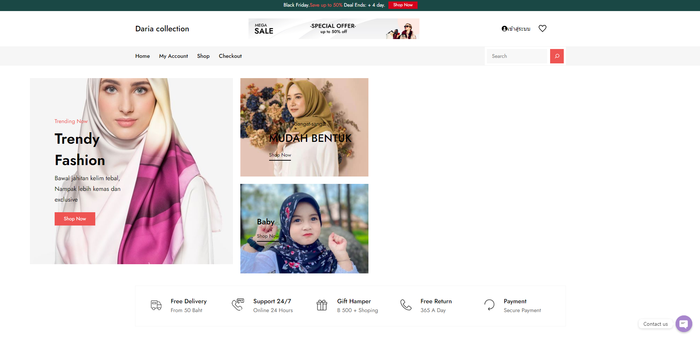
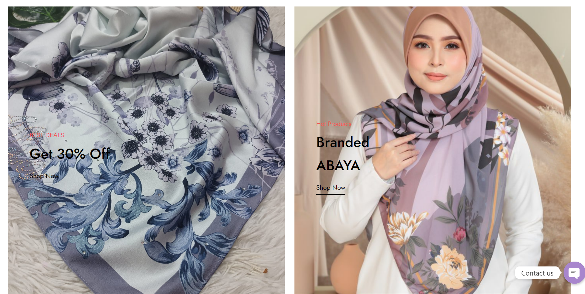
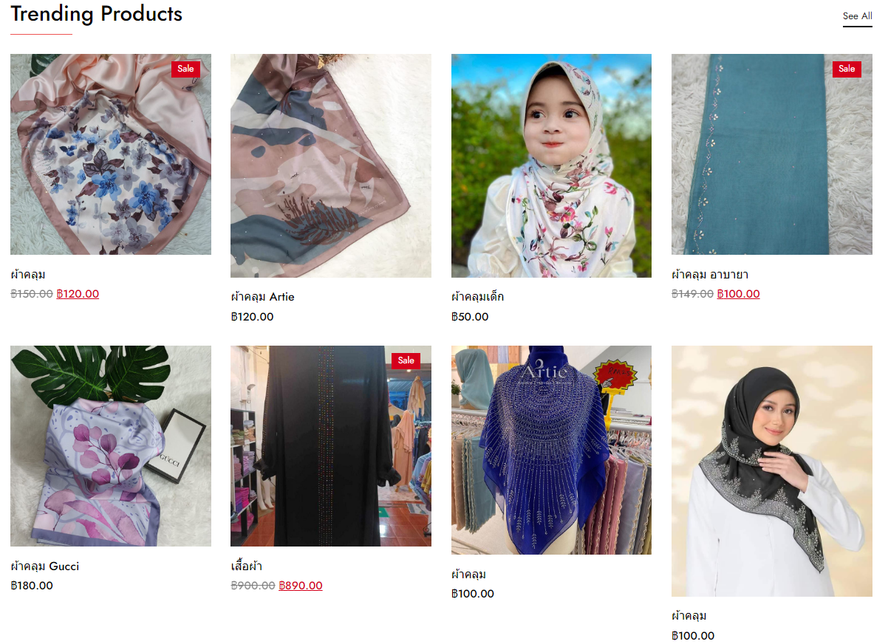
### Shoppage
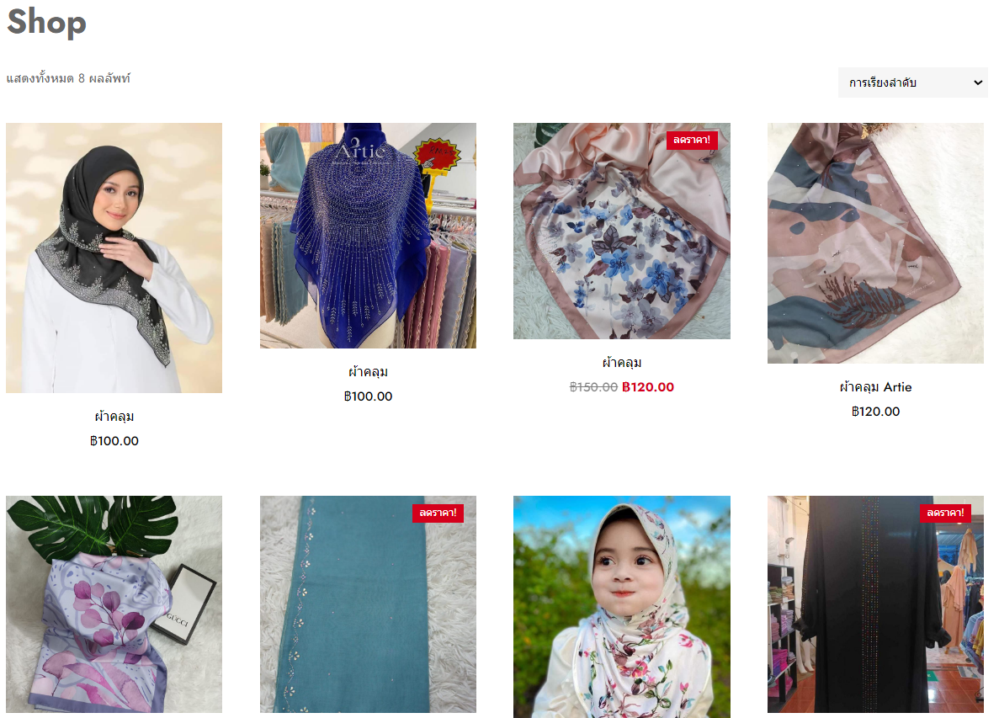

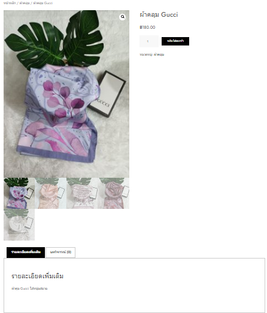
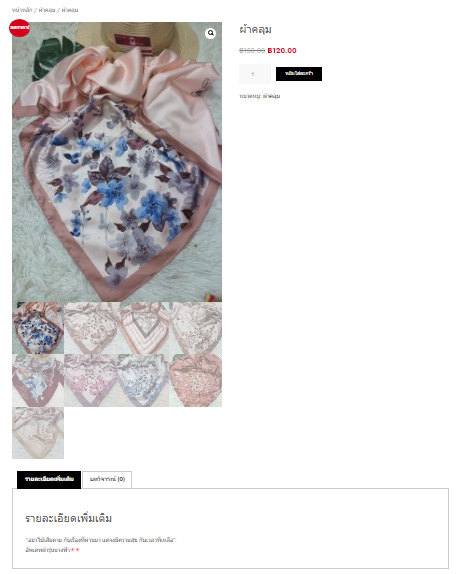
### Checkout
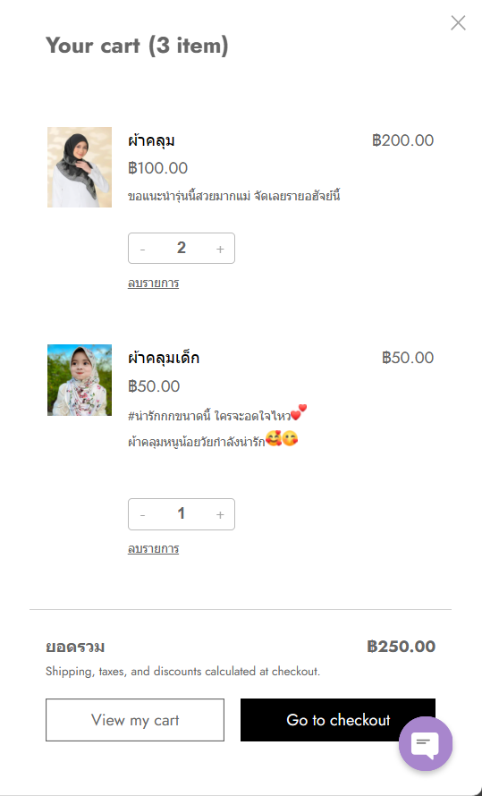

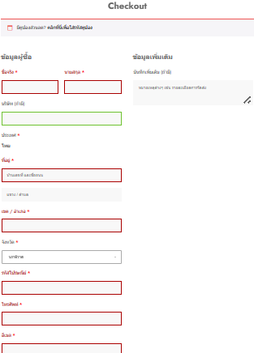
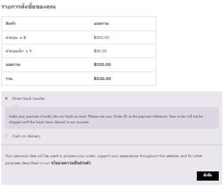

### Statement
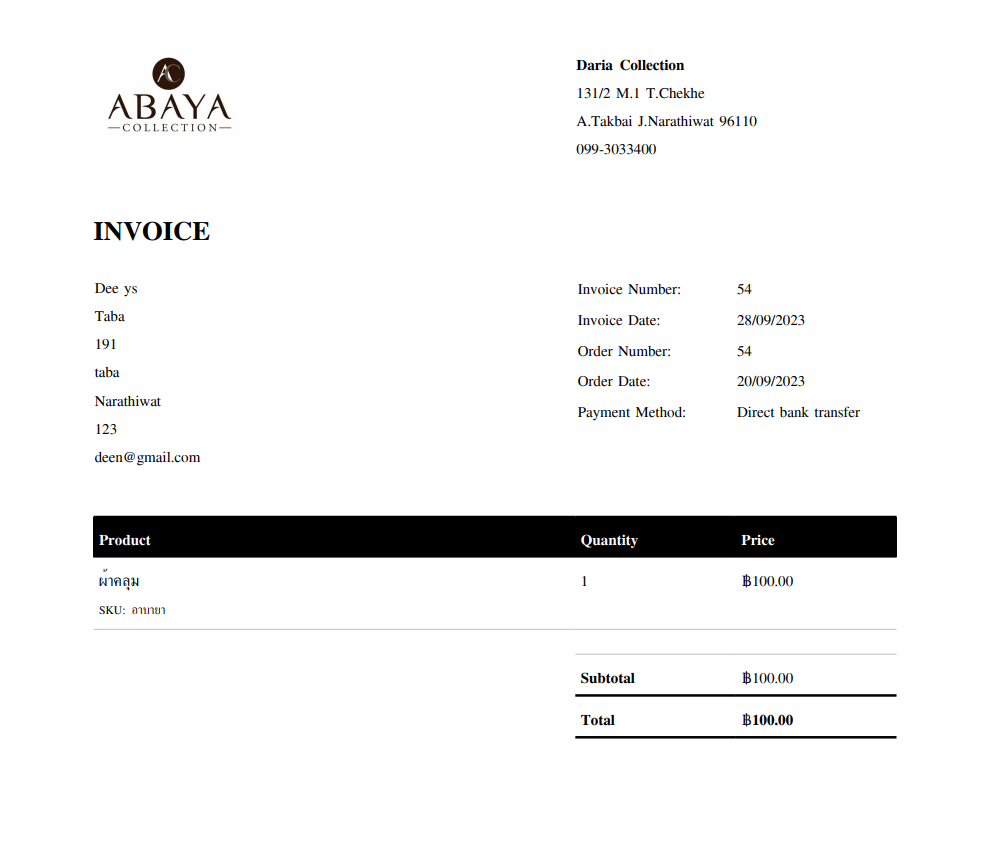

# BPMN Diagram
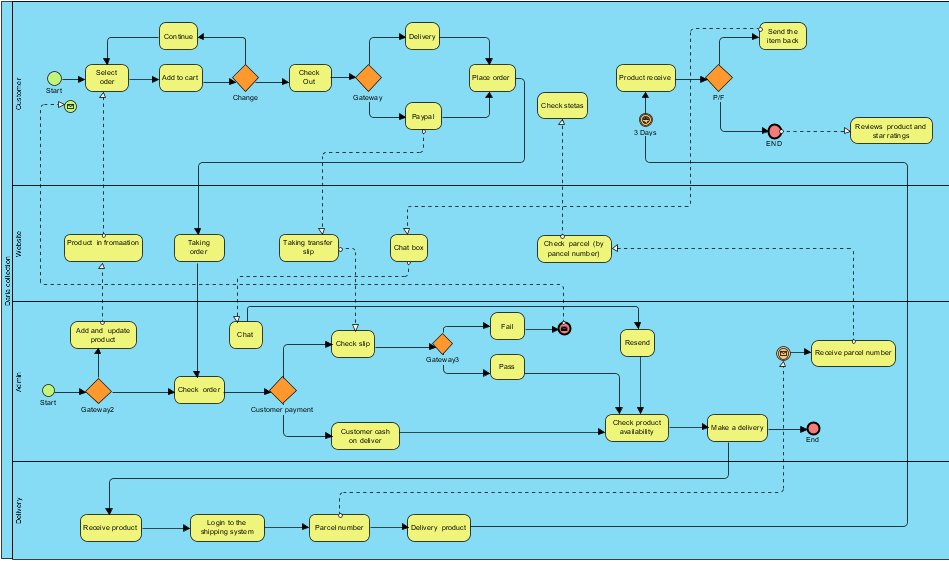
This BPMN diagram show my E-Commerce Website processes, showcasing key interactions and workflows that enhance the platform's user-friendly online Hiyab shop experience.

###  All Pools in BPMN
  - Customer
  - Website
  - Admin
  - Delivery
### Customer pool
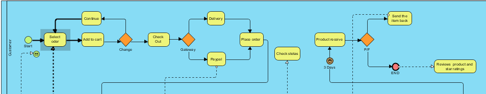.

-Start with the green dot. It marks the beginning of the customer journey on the platform.

-Select Products: The customer selects the desired products from the available options.

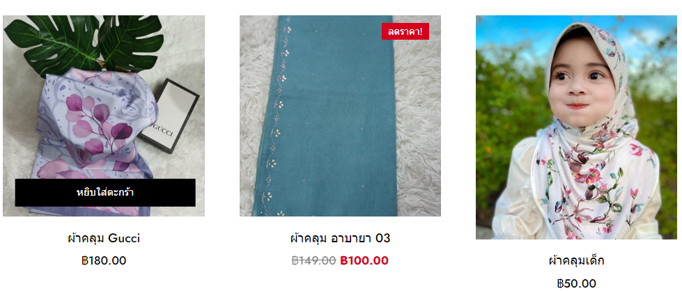.
- Add product to cart: After selecting the product step The customer checks in to the cart. If the customer is satisfied with the selected product They will go through the payment process. If the customer still hesitates in choosing a product, the customer can cancel the product or go back and select it again.

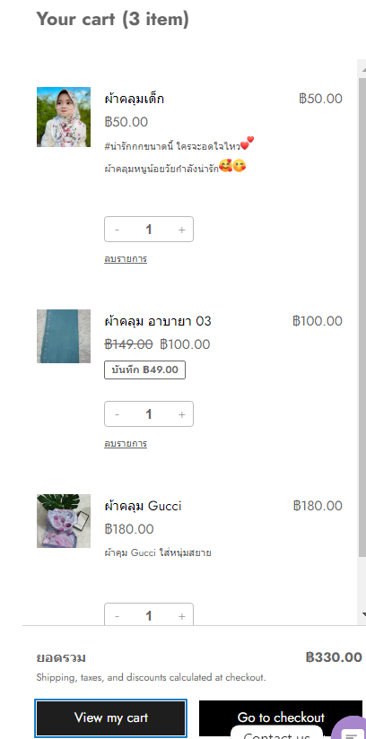.

-  Checkout Process: The process to Checkout the product. (The customer fill their shipping detail.)
-  Fill the shipping detail: The customer fill their shipping detail.

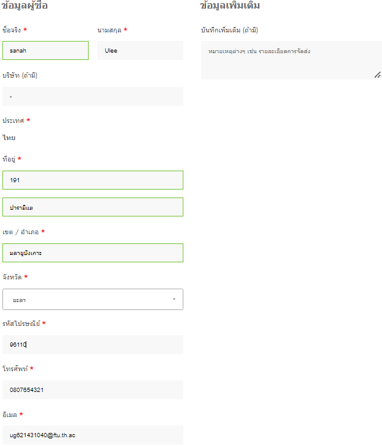.

-  Identify payment method: customer choose the payment method. In my website there are 2 methods: bank transfer and cash payment.

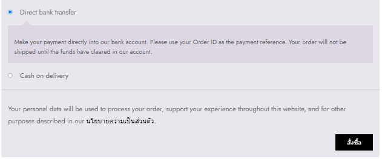.
  
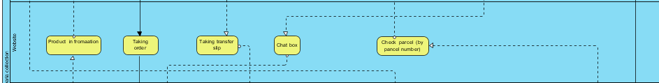.
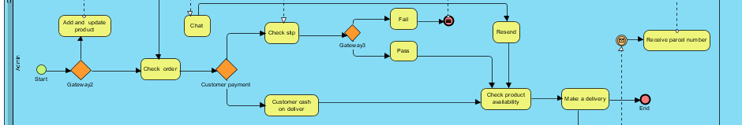.
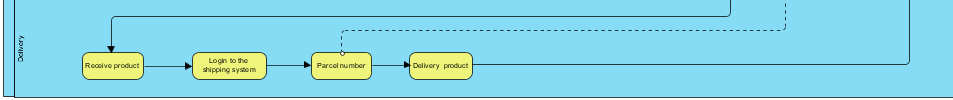.

