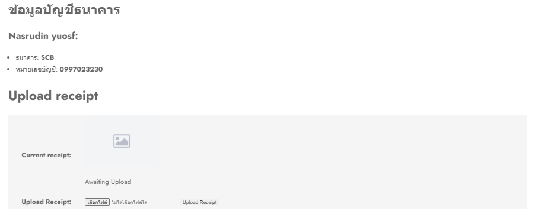
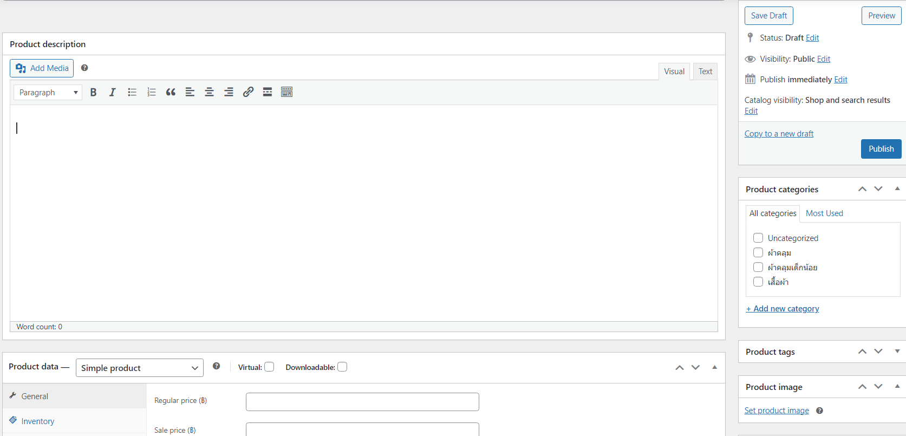
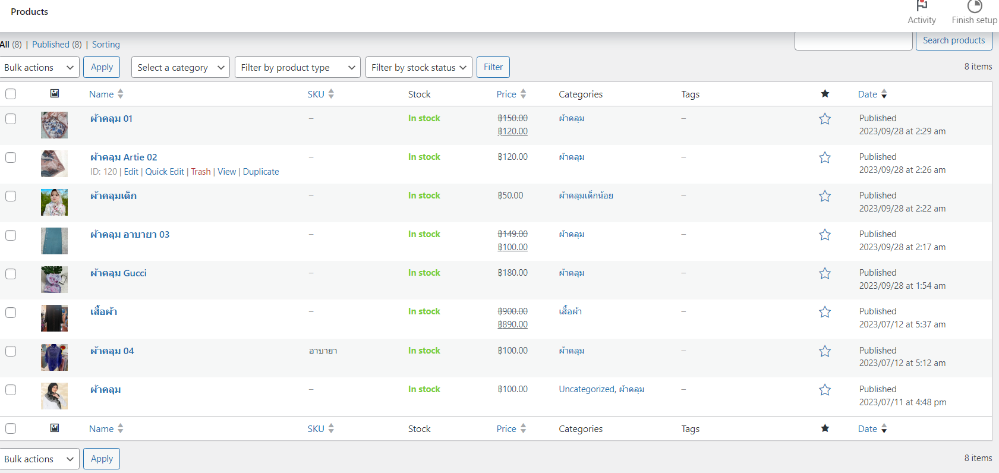
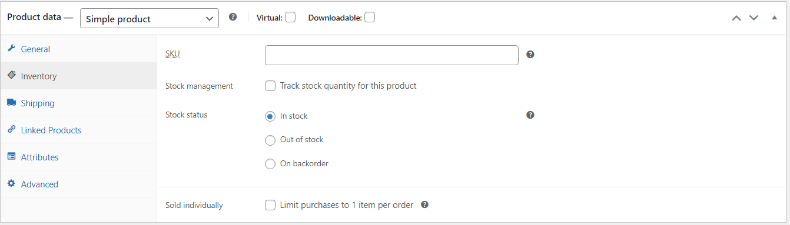
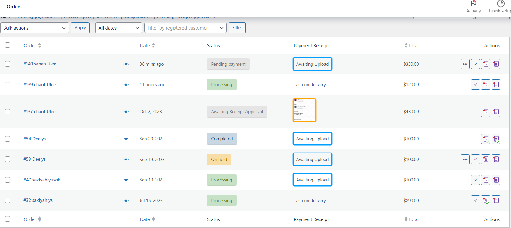

# Modern-Ecommerce-Platforms
Design and Develop Modern Ecommerce Plafform

Nasrudin yusof
# Abstract
This project is about the development of Daria collection's e-commerce website. The platform leverages WordPress and WooCommerce, providing a smooth and secure buying experience for covers and clothing. This document provides an overview of the project, methods, software requirements. and an overview with images The Business Process Model and Notation (BPMN) is also displayed, which describes the process and functionality of the website. This project aims to create a user-centric online store. Bridging the gap between purchasing covers in-store and digitally.

# 1. Introduction
In a world where shopping has become digital, Daria collection is going online. This project is all about introducing the Daria collectione-commerce website, where we bring the charm and variety of our physical stores to the internet.

Our e-commerce website powered by WordPress and WooCommerce makes shopping for covers and clothing easy. This introduction will give you a quick look at what we aim to achieve. and how we connect the online world to the book buying world.

In the following section We'll dive into the project's methodology, technology, and strategy. The goal was to create an online cover store that was attractive and easy to use. Through this project, Daria collection reinforces its commitment to promoting the love of literature in the digital age.

# 2. Method
  At first, we had to download Laragon and Runaragon in order to log in to Wordpress. Once successfully logged in, it will open Wordpress for us. There won't be much there. Everything we want to do or need we have to download ourselves. Can be downloaded within Wordpress The first thing we need to do is our website page. In making website pages, we have 2 routes to choose from. First, design it yourself. Second, find someone else's theme and turn it into your website page. I chose to find someone else's theme to use. I chose the Shope theme version 1.0.1 by SwiftStore on their website page. His theme is selling clothes. and choose a theme to change to make a website selling veils We have chosen a theme and the next step is to decorate our website. What do you want it to be like? Whatever you want, we can do as we want. We finished decorating everything. We have to put in the products we want and set the right price. Next we will add the plugin. First we need to explain what a plugin is. Plugins are WordPress extensions in the form of scripts that improve performance. and expand the ability to make a simple website into a complete website More suitable for use for each purpose

# 3. Software and Tools Used
3.1 Laragon: Laragon is utilized as our local development environment, providing a convenient platform for building and testing the Daria collection shop E-Commerce Website before deployment.

3.2 WordPress: WordPress serves as the primary content management system (CMS) for our website, offering a flexible and user-friendly environment for managing web content.

3.3 WooCommerce: WooCommerce is integrated seamlessly with WordPress, empowering our website with e-commerce capabilities, including product management, shopping cart functionality, and secure payment processing.

3.4 Elementor: Elementor Elementor is a versatile page builder plugin employed to streamline the design process. It allows for easy customization of layouts and visual elements, enhancing the website's aesthetics and functionality.

3.5 PDF Invoices & Packing Slips for WooCommerce: PDF Invoices & Packing Slips for WooCommerce is responsible for generating professional invoices and packing slips for customer orders, ensuring a smooth and professional shopping experience.

3.6 Contact Form 7: Conract From 7 can manage multiple contact forms, plus you can customize the form and the mail contents flexibly with simple markup. The form supports Ajax-powered submitting, CAPTCHA, Akismet spam filtering and so on.

2.7 Chaty: Chaty is a Floating Chat Widget plugin that user can click on link to get more contact with the website.

# 4. Visual Overview
### HomePage

### Shoppage

### Checkout

### Statement

# BPMN Diagram

This BPMN diagram show my E-Commerce Website processes, showcasing key interactions and workflows that enhance the platform's user-friendly online Hiyab shop experience.

###  All Pools in BPMN
  - Customer
  - Website
  - Admin
  - Delivery
### Customer pool

-Start with the green dot. It marks the beginning of the customer journey on the platform.

-Select Products: The customer selects the desired products from the available options.

- Add product to cart: After selecting the product step The customer checks in to the cart. If the customer is satisfied with the selected product They will go through the payment process. If the customer still hesitates in choosing a product, the customer can cancel the product or go back and select it again.

-  Checkout Process: The process to Checkout the product. (The customer fill their shipping detail.)
-  Fill the shipping detail: The customer fill their shipping detail.

-  Identify payment method: customer choose the payment method. In my website there are 2 methods: bank transfer and cash payment.

- Payment Process: There are 2 methods to choose from. The first method is cash on delivery. The second method is a bank transfer. Customers can pay at their convenience. (Destination or bank transfer) for bank transfer Customers can send proof of transfer right away. We will have a place to send evidence to you. If the customer pays on delivery, the customer waits to pay when the driver comes to deliver the product.
  
  

### Website pool

For the website to be a center between customers and system administrators.
Starting from the format

- The first is product information that allows customers to choose.

- The second is to receive customer orders before the data is sent to the backend.

- The third is to receive the slip from the customer who has chosen to transfer before the data is sent to the backend.

- The Fourth is to respond to customer chats.

###  Admin pool

- Add product: This task represents the process of adding a new product to your e-commerce store's catalog.

It includes entering product details, assigning categories, and setting pricing.

- Publish Product: This task involves making the approved product visible to customers on the website. It ensures that the product is included in relevant search results and categories.

- Update Product Information: This task allows admins to modify existing product details, such as descriptions, prices, or images. It's used for maintaining accurate product information.

-  Remove Product: When a product is discontinued or permanently out of stock, this task is used to remove the product from the website. It ensures customers can no longer purchase the item.

.

- Inventory Management :This task involves monitoring and managing product inventory levels. Admins may use this task to adjust stock levels, track product availability, and reorder items when necessary.

  

- Check order : Admin will check the order list to see if there are any new orders or not. If there is a new order, the admin will go to the next task.
- Check slip and confirm order process: This process admin will check the slip of payment and confirm order.

  

- Correct gataway : when admin check correctness about payment. If correct, It will go to Check Stock process. If not correct, It will cancel the order.

- Check Stock process : admin will check stock. If have product enough, It will go to next process (Prepare order for shipping process). If out of stock, the order will cancel.

- Prepare order for shipping process : this task is to prepare product for shipping or pack items properly for delivery.

- Ship order to shipping company process :This process is about sent product to shipping company.

### Delivery pool

Delivery process
- First delivery taking customer product from admin.
- And put in in their system
- Make a pacel number (Give to admin)
- And sent product to customer (receive money from customer for who choes cash on deliver)

