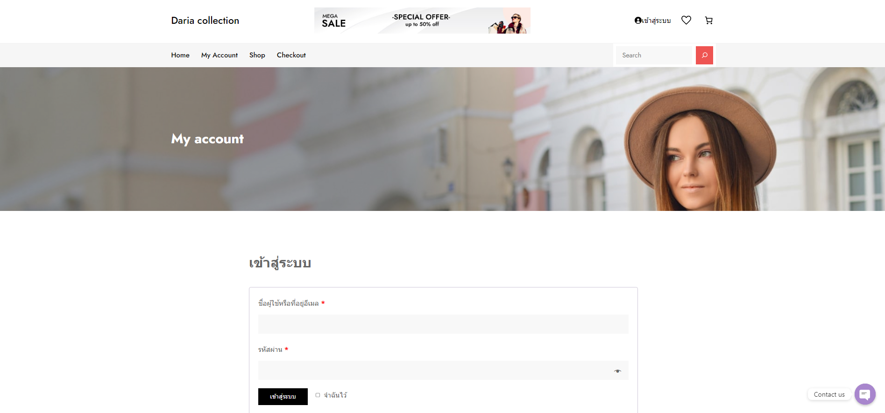

# Modern-Ecommerce-Platforms
Design and Develop Modern Ecommerce Plafform

Nasrudin yusof
# Abstract
This project is about the development of Daria collection's e-commerce website. The platform leverages WordPress and WooCommerce, providing a smooth and secure buying experience for covers and clothing. This document provides an overview of the project, methods, software requirements. and an overview with images The Business Process Model and Notation (BPMN) is also displayed, which describes the process and functionality of the website. This project aims to create a user-centric online store. Bridging the gap between purchasing covers in-store and digitally.

# 1. Introduction
In a world where shopping has become digital, Daria collection is going online. This project is all about introducing the Daria collectione-commerce website, where we bring the charm and variety of our physical stores to the internet.

Our e-commerce website powered by WordPress and WooCommerce makes shopping for covers and clothing easy. This introduction will give you a quick look at what we aim to achieve. and how we connect the online world to the book buying world.

In the following section We'll dive into the project's methodology, technology, and strategy. The goal was to create an online cover store that was attractive and easy to use. Through this project, Daria collection reinforces its commitment to promoting the love of literature in the digital age.

# 2. Software and Tools Used
2.1 Laragon: Laragon is utilized as our local development environment, providing a convenient platform for building and testing the Daria collection shop E-Commerce Website before deployment.

2.2 WordPress: WordPress serves as the primary content management system (CMS) for our website, offering a flexible and user-friendly environment for managing web content.

2.3 WooCommerce: WooCommerce is integrated seamlessly with WordPress, empowering our website with e-commerce capabilities, including product management, shopping cart functionality, and secure payment processing.

2.4 Elementor: Elementor Elementor is a versatile page builder plugin employed to streamline the design process. It allows for easy customization of layouts and visual elements, enhancing the website's aesthetics and functionality.

2.5 PDF Invoices & Packing Slips for WooCommerce: PDF Invoices & Packing Slips for WooCommerce is responsible for generating professional invoices and packing slips for customer orders, ensuring a smooth and professional shopping experience.

2.6 Contact Form 7: Conract From 7 can manage multiple contact forms, plus you can customize the form and the mail contents flexibly with simple markup. The form supports Ajax-powered submitting, CAPTCHA, Akismet spam filtering and so on.

2.7 Chaty: Chaty is a Floating Chat Widget plugin that user can click on link to get more contact with the website.

# 3. Visual Overview
## My Account

## Home

## Shop

## Checkout

# 4. BPMN Diagram

